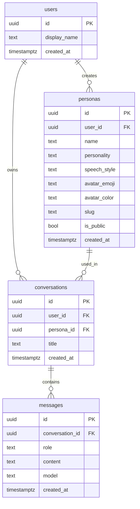

# Persona — 사용자 맞춤형 AI 캐릭터 챗봇 플랫폼

> 비개발자도 이름과 성격, 말투를 가진 AI 페르소나를 만들고, 공유 링크로 바로 체험시키는 서비스입니다.

Persona는 단순 CRUD 앱이 아니라, **(1) DB 레벨 인가(RLS)로 보안 경계 확립**, **(2) LLM 응답을 SSE로 스트리밍 처리**, **(3) 비결정적 AI 출력의 포맷을 백엔드에서 규격화**하여 “제품으로서의 AI 대화 경험”을 만들었습니다.

---

## 핵심 가치 (1분 요약)

- 🔐 **보안/RLS**: Supabase Row Level Security(RLS)로 로그인 사용자가 **자신의 페르소나/대화/메시지에만** 접근하도록 설계했습니다.
- ⚡ **스트리밍 최적화**: Next.js Route Handlers + Vercel AI SDK로 Gemini 응답을 **Server-Sent Events(SSE)** 방식으로 스트리밍해 대기 시간을 줄였습니다.
- 🧱 **출력 규격화**: 시스템 프롬프트로 마크다운 구조(예: `### 💡 [초보자를 위한 IT 용어 번역기]`)를 강제하고, 프론트에서 파싱/분리 렌더링 가능한 응답 규격을 설계했습니다.

---

## 프로젝트 아키텍처

```text
[Browser]
  |  (HTTP + SSE)
  v
[Next.js 14 App Router]
  - UI (Server/Client Components)
  - Route Handlers (/api/...)
        |
        | 1) Auth
        v
   [Supabase Auth]
        |
        | 2) Data (RLS enforced)
        v
 [Supabase Postgres]
  - users/personas/conversations/messages
        |
        | 3) LLM Streaming
        v
[Vercel AI SDK]
  - SSE streaming
        |
        v
 [Google Gemini API]
```

---

## 기술 스택 및 도입 배경

- **Next.js 14 (App Router, Route Handlers)**: UI와 API를 단일 런타임으로 구성해 데이터 흐름/인증 경계를 일관되게 유지했습니다.
- **Supabase (PostgreSQL, Auth, RLS)**: 생산성을 확보하면서도 DB 레벨 인가(RLS)로 “서비스 수준 보안”을 구현하기 위해 선택했습니다.
- **Vercel AI SDK**: SSE 스트리밍을 표준화해 클라이언트 체감 응답 속도를 개선하고, 서버-클라이언트 메시지 포맷을 안정적으로 연결했습니다.
- **Google Gemini API**: 페르소나(이름/성격/말투) 기반 시스템 프롬프트를 주입해 일관된 캐릭터 응답을 생성합니다.

---

## 핵심 백엔드 기능 및 ERD 설계 방향

### 데이터 모델

- `users`: Auth 사용자 프로필
- `personas`: 페르소나(이름/성격/말투/아바타/slug/공개여부)
- `conversations`: 사용자와 페르소나 간 대화방
- `messages`: 대화 메시지(role/content/model/timestamp)



### 1) 보안 및 데이터 아키텍처: Supabase RLS

Persona의 보안 목표는 “API가 실수하더라도 데이터가 새지 않게”였습니다.

- `personas`: `auth.uid() = user_id`인 행만 CRUD 허용
- `conversations`: `auth.uid() = user_id`인 행만 조회/수정/삭제
- `messages`: 메시지가 속한 `conversation.user_id = auth.uid()`일 때만 조회/추가

즉, 애플리케이션 레이어가 아니라 **DB 레벨에서 인가 조건을 강제**해 클라이언트 변조나 API 버그로 인한 데이터 노출 가능성을 줄였습니다.

### 2) 비동기 스트리밍 처리: Vercel AI SDK + Gemini (SSE)

LLM 응답을 “완료 후 한 번에 반환”하면 UX가 느려집니다.

- Route Handler에서 Gemini 호출
- Vercel AI SDK로 SSE 스트리밍 변환
- 클라이언트는 토큰이 도착하는 즉시 렌더링

저장은 스트리밍 완료 시점(`onFinish`)에 assistant 메시지를 저장하는 방식으로 “즉시성(UX)”과 “일관된 저장”을 동시에 챙겼습니다.

---

## 트러블슈팅 및 기술적 고민

### (1) 스트리밍 응답과 DB 저장 타이밍

- 문제: 스트리밍 중간에 DB를 계속 업데이트하면 비용/부하가 커지고, 트랜잭션 경계도 애매해집니다.
- 해결: **클라이언트는 스트리밍으로 즉시 렌더링**, 서버는 **완료 시점에만 최종 메시지 저장**(assistant)으로 단순화했습니다.

### (2) “비개발자 맞춤형 IT 통역사”를 위한 응답 규격화

LLM 출력은 비결정적이어서, UI가 기대하는 형태로 항상 오지 않을 수 있습니다.

- 시스템 프롬프트에서 특정 마크다운 헤더 구조를 강제했습니다.
  - `### 💡 [초보자를 위한 IT 용어 번역기]`
  - `### ✅ 핵심 요약`
  - `### 🧩 예시 코드/상황`
  - `### 🔎 주의할 포인트`
- 프론트는 이 헤더를 기준으로 파싱하여 섹션별로 분리 렌더링합니다.

결과적으로 AI 응답을 “텍스트”가 아니라 **파싱 가능한 데이터 포맷**으로 다루게 되었고, 제품 품질(일관성/가독성)을 크게 올릴 수 있었습니다.

### (3) 게스트 모드(공유 링크)와 저장 경계

- 로그인 사용자는 저장형 대화로 이력 관리
- 게스트는 링크 기반 체험을 제공하되 **DB 저장은 하지 않음**

저장 경계를 분리해 개인정보/저장 비용을 줄이면서도, 공유 링크의 “체험 전환”은 유지했습니다.

---

## 주요 경로

- 대시보드: `/dashboard`
- 페르소나 생성: `/personas/new`
- 공개 채팅(공유 링크): `/chat/[persona-slug]`
