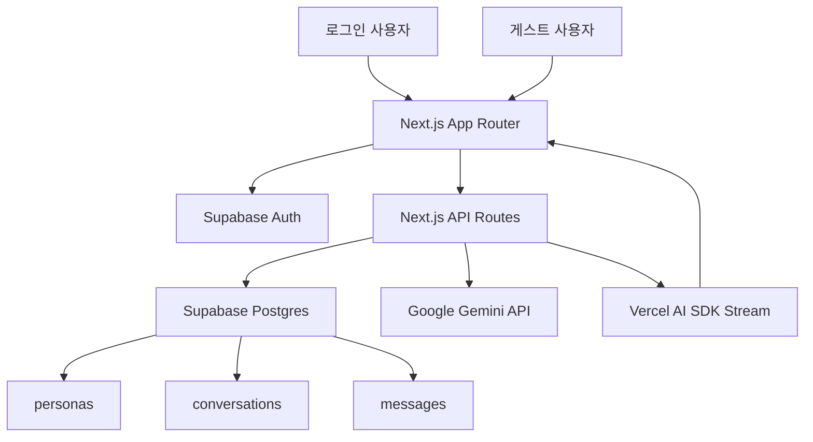

# Persona Project Details

## 프로젝트 개요

`Persona`는 단순한 챗봇이 아니라, 사용자가 직접 AI 캐릭터를 설계하고 대화 경험으로 배포할 수 있도록 만든 플랫폼입니다.

해결하려는 문제는 다음과 같습니다.

- 특정 성격과 말투를 유지하는 캐릭터형 AI를 만들고 싶습니다.
- 사용자별로 서로 다른 AI 페르소나를 저장하고 다시 불러오고 싶습니다.
- 내가 만든 AI를 링크 하나로 공유하고 싶습니다.
- 로그인 사용자 대화와 게스트 대화를 구분해 관리하고 싶습니다.

이 프로젝트는 이를 `페르소나 생성 -> 대화 -> 공유`라는 하나의 흐름으로 연결합니다.

## 아키텍처



## 요청 흐름

### 로그인 사용자 채팅

1. 사용자가 대시보드에서 페르소나를 선택합니다.
2. `/api/chat/init`으로 conversation을 생성합니다.
3. 채팅 메시지를 `/api/chat/stream`으로 전송합니다.
4. 서버가 conversation과 persona를 조회합니다.
5. 시스템 프롬프트를 구성한 뒤 Gemini를 호출합니다.
6. 응답을 스트리밍으로 반환합니다.
7. 완료 시 assistant 메시지를 `messages`에 저장합니다.

### 게스트 공개 채팅

1. 사용자가 `/chat/[slug]`에 접속합니다.
2. 공개 persona를 조회합니다.
3. `/api/public-chat/stream`을 호출합니다.
4. 서버가 공개 persona를 확인합니다.
5. 시스템 프롬프트를 구성한 뒤 Gemini를 호출합니다.
6. 응답만 스트리밍으로 반환하고 저장은 수행하지 않습니다.

## 핵심 페이지

### `/`

서비스 랜딩 페이지입니다. 프로젝트 소개, 핵심 기능, 예시 페르소나, 공유 흐름을 보여줍니다.

### `/login`

Supabase Auth 기반 이메일/비밀번호 로그인/회원가입 페이지입니다.

### `/dashboard`

로그인 사용자 전용 대시보드입니다.

- 생성한 페르소나 목록 확인
- 검색/정렬 UI
- 카드 형태 UI
- 편집 / 삭제 / 공유 링크 복사 / 대화하기 이동

### `/personas/new`

새 페르소나 생성 페이지입니다.

### `/personas/[id]/edit`

기존 페르소나 수정 페이지입니다.

### `/chat/[slug]`

공개 채팅 페이지입니다.

- 로그인 사용자는 저장형 채팅 UI 사용
- 비로그인 사용자는 게스트 채팅 UI 사용
- 하단에 제작자 배너 표시

## API 구조

### 페르소나 API

#### `GET /api/personas`

현재 로그인 사용자의 페르소나 목록을 조회합니다.

#### `POST /api/personas`

새 페르소나를 생성합니다.

요청 예시:

```json
{
  "name": "묵묵",
  "personality": "차분하고 논리적으로 설명하는 백엔드 개발자",
  "speech_style": "formal",
  "avatar_emoji": "🐷",
  "avatar_color": "#1f6b8f"
}
```

#### `GET /api/personas/[id]`

특정 페르소나를 조회합니다.

#### `PATCH /api/personas/[id]`

특정 페르소나를 수정합니다.

#### `DELETE /api/personas/[id]`

특정 페르소나를 삭제합니다.

### 채팅 API

#### `POST /api/chat/init`

로그인 사용자의 conversation을 생성하고, persona 정보 및 기존 메시지를 반환합니다.

#### `POST /api/chat/stream`

로그인 사용자용 저장형 스트리밍 채팅 API입니다.

- conversation 확인
- persona 확인
- user 메시지 저장
- Gemini 응답 스트리밍
- finish 시 assistant 메시지 저장

#### `POST /api/public-chat/stream`

공개 게스트 스트리밍 채팅 API입니다.

- slug로 공개 persona 조회
- Gemini 응답 스트리밍
- 저장 없음

## 데이터베이스 설계

스키마 파일:

- [supabase/schema.sql](/Users/limjinmuk/Desktop/Persona/supabase/schema.sql)

### `users`

Supabase Auth의 `auth.users`와 1:1로 연결되는 프로필 테이블입니다.

주요 컬럼:

- `id`
- `display_name`
- `created_at`
- `updated_at`

### `personas`

사용자가 만든 AI 페르소나를 저장합니다.

주요 컬럼:

- `id`
- `user_id`
- `name`
- `personality`
- `speech_style`
- `slug`
- `is_public`
- `creator_name`
- `avatar_emoji`
- `avatar_color`
- `created_at`
- `updated_at`

### `conversations`

로그인 사용자의 채팅 세션 단위 데이터를 저장합니다.

주요 컬럼:

- `id`
- `user_id`
- `persona_id`
- `title`
- `created_at`
- `updated_at`

### `messages`

대화 메시지 단위 데이터를 저장합니다.

주요 컬럼:

- `id`
- `conversation_id`
- `role`
- `content`
- `model`
- `created_at`

## 보안 및 접근 제어

### 인증

인증은 Supabase Auth를 사용합니다.

- 로그인 사용자만 `/dashboard`, `/personas/*` 접근 가능
- `/chat/[slug]`는 게스트 허용
- 인증 콜백은 `/auth/callback`

관련 파일:

- [middleware.ts](/Users/limjinmuk/Desktop/Persona/middleware.ts)
- [lib/supabase/server.ts](/Users/limjinmuk/Desktop/Persona/lib/supabase/server.ts)
- [lib/supabase/public.ts](/Users/limjinmuk/Desktop/Persona/lib/supabase/public.ts)

### RLS 정책

`supabase/schema.sql`에서 Row Level Security 정책을 적용합니다.

- `users`: 본인 데이터만 조회/수정 가능
- `personas`: 본인 데이터만 CRUD 가능
- `personas_select_public`: 공개 페르소나는 비로그인 사용자도 조회 가능
- `conversations`, `messages`: 본인 대화에 대해서만 접근 가능

## 구현 포인트

### 1. 페르소나 프롬프트 주입

모델 호출 시 시스템 프롬프트에 페르소나 정보를 구조화해 포함합니다.

예시 개념:

```txt
너는 사용자와 대화하는 AI 페르소나다.
페르소나 이름: 묵묵
성격: 차분하고 논리적으로 설명하는 백엔드 개발자
말투는 한국어 격식체로, 정중하고 차분하게 답해.
규칙: 모르는 내용은 아는 척하지 말고 질문하거나 한계를 말해.
```

### 2. 저장형 채팅과 비저장형 채팅 분리

로그인 채팅과 게스트 채팅을 다른 API로 분리했습니다.

- 로그인: `/api/chat/stream`
- 게스트: `/api/public-chat/stream`

이 분리를 통해 권한과 저장 정책을 단순하게 유지합니다.

### 3. AI SDK v5 메시지 포맷 대응

현재 채팅 UI는 Vercel AI SDK v5 기준으로 동작합니다.

- 클라이언트는 `sendMessage({ text })`로 메시지를 전송합니다.
- 서버는 `messages[].parts[].text`를 읽어 실제 사용자 입력을 추출합니다.
- 렌더링도 `message.parts` 기준으로 처리합니다.

관련 파일:

- [lib/ai-ui.ts](/Users/limjinmuk/Desktop/Persona/lib/ai-ui.ts)
- [components/chat/ChatClient.tsx](/Users/limjinmuk/Desktop/Persona/components/chat/ChatClient.tsx)
- [components/chat/GuestChatClient.tsx](/Users/limjinmuk/Desktop/Persona/components/chat/GuestChatClient.tsx)

## 트러블슈팅

### 페르소나가 응답하지 않을 때

- 개발 서버가 실제로 켜져 있는지 확인합니다.
- `GOOGLE_GENERATIVE_AI_API_KEY`가 설정되어 있는지 확인합니다.
- 공개 채팅인지, 로그인 저장형 채팅인지 경로를 확인합니다.
- Supabase 공개 조회 정책이 적용되어 있는지 확인합니다.
- AI SDK v5 메시지 포맷과 서버 파싱 로직이 맞는지 확인합니다.

### `/personas/new`가 열리지 않을 때

로그인하지 않은 상태라면 `middleware`에 의해 `/login`으로 리다이렉트됩니다.

### 공개 채팅은 되는데 저장형 채팅이 안 될 때

대체로 다음 둘 중 하나입니다.

- 세션이 없어서 `/api/chat/init`, `/api/chat/stream`이 `401`
- Supabase RLS 또는 `users` 프로필 생성 흐름 문제

## 향후 개선 기능들

- 대화 목록과 최근 대화 재개 기능
- persona prompt 템플릿 고도화
- 이미지 아바타 업로드 지원
- 좋아요/복제 같은 공유 확산 기능
- 관리자 페이지 및 신고/비공개 전환 기능
- 토큰 사용량 및 비용 추적
